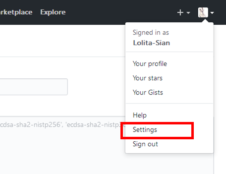
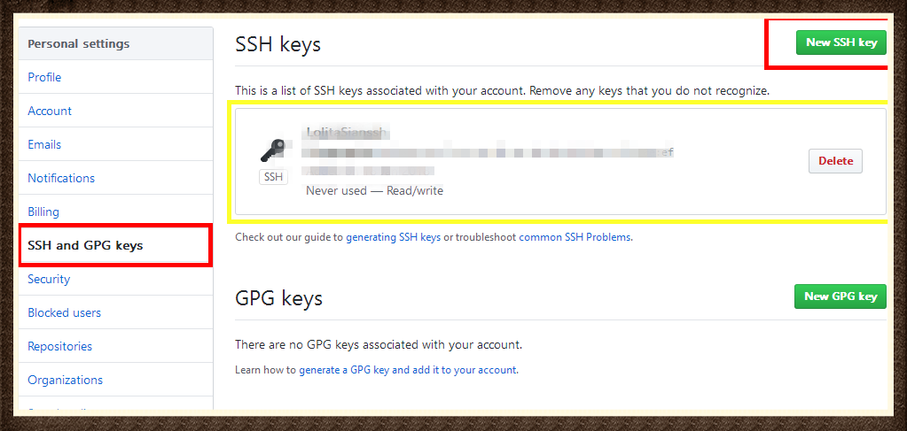
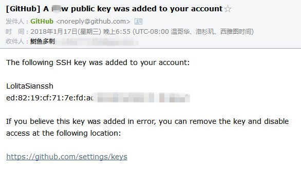

# GitHub教程 SSH keys配置

 - SSH 为 Secure Shell 的缩写，由 IETF 的网络小组（Network Working Group）所制定；SSH 为建立在应用层基础上的安全协议。

###  在管理Git项目上，有两种克隆到本地的方法。
 
 - 直接使用https url克隆到本地
 
 - 使用SSH url克隆到本地

#### 这两种方式的主要区别在于：

 - 使用https url对初学者来说会比较方便，复制https url然后到git Bash里面直接用clone命令克隆到本地就好了，但是每次fetch和push代码都需要输入账号和密码，这也是https方式的麻烦之处。

 - 使用SSH url需要在只用之前先配置和添加好SSH key。每次fetch和push代码都不需要输入账号和密码，如果你想要每次都输入账号密码才能进行fetch和push也可以另外进行设置。


## 1.检查你电脑上是否有SSH Key

 ```sh
 ~/.ssh 或者用~/.ssh ls
 ``` 
 上边这行命令的作用是看一哈你的电脑上有没有.ssh文件夹。

 - 如果电脑上有，就会显示bash: /c/Users/…/.ssh: Is a directory
 
 - 如果电脑上没有，那就显示bash: /c/Users/…/.ssh: No such file or directory

 

 

## 2.创建SSH Key

 #### 如果你电脑上有了，你就可以直接跳过这一步

 在Git Bash中输入
 ```sh
 $ ssh-keygen -t rsa -C "你的邮箱"
 ```
 

 然后就会显示这两行：
 ```sh
 Generating public/private rsa key pair.
 Enter file in which to save the key (/c/Users/16627/.ssh/id_rsa):
 ```

 这是让你输入一个文件名，用于保存刚才生成的 SSH key 代码。为了避免麻烦，不用输入，直接回车，那么就会默认生成id_rsa和id_rsa.pub两个秘钥文件。

 这时候已经创建好.ssh这个文件夹了，会提示：

 ```sh
 Created directory ‘/c/Users/16627/.ssh’.
 ```

 紧接着又会问你：

 ```sh
 Enter passphrase (empty for no passphrase):
 ```

 就是让你输入密码，如果你设置了密码，那在你使用ssh传输文件的时候，你就要输入这个密码。为了避免麻烦，建议不用设置，直接回车。

 ```sh
 Enter same passphrase again:
 ```

 这就是让你再输入一次密码，就跟我们注册账号时候设置密码需要设置两次一样。上一步没设置密码，这里直接回车就可以了。到这里你的秘钥就设置好了，你会收到这段代码提示：

 ```sh
 Your identification has been saved in /c/Users/…/.ssh/id_rsa
 Your public key has been saved in /c/Users/…/.ssh/id_rsa.pub
 ```

 还会向你展示你的秘钥长啥样

 


 当你看到上面这段代码，那就说明你的 SSH key 已经创建成功，你可以再使用 ~/.ssh 看一下，现在文件是真的存在了。

 


## 3.添加SSH Key到GitHub

 首先打开Github网页

  

 
 
 （黄色框框是我已经建立的SSH key。）

 点击右上角新建一个SSH Key。


 

 title随便给他起个名字就好。然后是key，这时候你要打开你刚才在电脑上的SSH key。
 
 还记得这一步吗：

 

 按照红框框里的路径，找到.ssh文件夹。用记事本打开id_rsa.pub文件，全选其中的内容粘贴到网页的Key中。

 

 ### 然后你就会受到建立成功的邮件了。
 
 


## 4.测试一下该SSH key
 
 在git Bash 中输入以下代码
 
 ```sh
 $ ssh -T git@github.com
 ```
 
 #### 注意是git@github.com，不是你的邮箱。

 然后会提示你：
 
 ```sh
 The authenticity of host ‘github.com (13.229.188.59)’ can’t be established.
 RSA key fingerprint is SHA256:nThbg6kXUp…
 Are you sure you want to continue connecting (yes/no/[fingerprint])?
 ```

 输入yes，回车

 

 接下来就会提示你输入密码，如果上边设置ssh的时候，你没设置密码会提示你：
 
 ```sh
 Warning: Permanently added ‘github.com,192.30.255.112’ (RSA) to the list of known hosts.
 ```
 
 警告完了，如果你能看到如下提示，那你已经成功设置SSH密钥。

 ```sh
 Hi “用户名”! You’ve successfully authenticated, but GitHub does not provide shell access.
 ```
 
 如果你看到 access denied，者表示拒绝访问，那么你就需要使用 https 去访问。


 网站：
 https://blog.csdn.net/qq_36667170/article/details/79094257